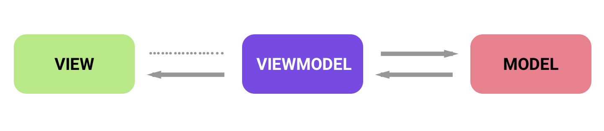
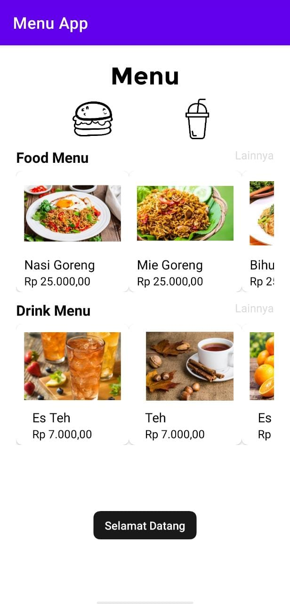
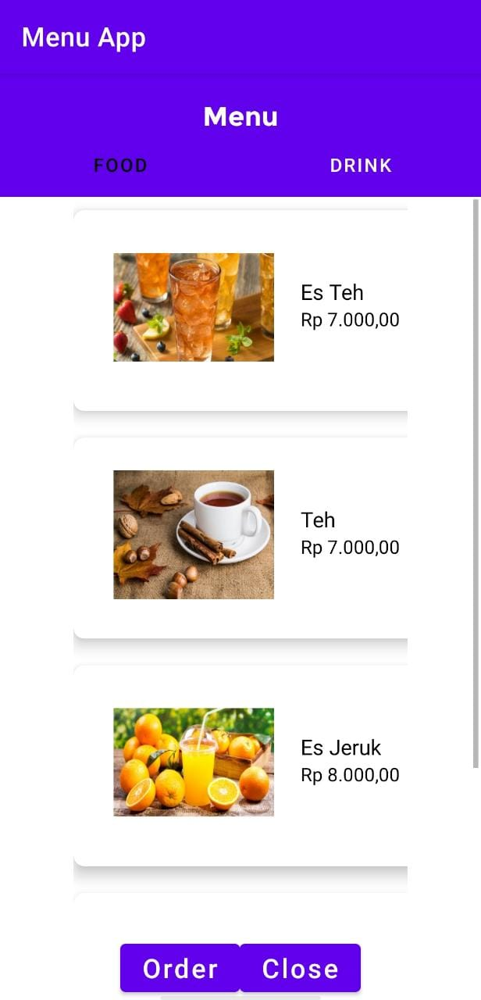

# Piranti Bergerak - Menu App

### Overview and App Lifecycle
Menu App is a simple Android app that digitalize your restaurant menu and allow user to choose the menu easily. This application was built with 2 activities (Main and Choose Menu) and 2 fragment (Food and Drink) which connected by 2 kinds of navigation (Intent and View Pager). Intent navigation is used to move between activities and View Pager is used to move between fragment. When the system in Fragment Food or Drink is paused, the application will pop a Toast "Sistem berhenti sementara". And when the system resumes, the application will pop a Tost "Pilih menu kesukaanmu". If the Menu Activity is destroyed, the application will redirect to Main Activity and the system will pop a Toast "Order diproses". 

### Architecture

Menu App is using MVVM(Model-View-ViewModel) architecture. Every View(activity and fragment) have one ViewModel that connected to a Model. We used MVVM because this architecture is loosely-coupled so it's easier to maintenance as the complexity increase. As an example, a ViewModel doesn't have any reference to any View, just View that have reference to the ViewModel and this mean View and ViewModel doesn't have 1:1 tight bound reference. This will make a change in the design and code will be easier. With the plan of changing app theme and design in mind, we choose MVVM as our architecture.

## Visuals
         
Home view, Food list view, and Drink list view of Menu App.

## Installation

Clone this repository and import into Android Studio

```bash
git clone https://github.com/varydabe/piranti-bergerak.git
```

## Usage

Build the app using Android Studio.

## Roadmap

- **(15/03/21)** Initialize menu app with 3 page and 2 navigation 
- **(22/03/21)** Change activity to fragment view and add Activity Lifecycle (OnCreate, OnPause, OnResume, and OnDestroy) 
- **(05/04/21)** Apply Model-View-ViewModel(MVVM) Architecture
- **(10/04/21)** Updated README and docs
- **Next** Consume API from third party, there's posibility to change the app theme. 

## Maintainers
This project is mantained by:
* [Dimas Shaquille Himawan](https://github.com/dshimawan)
* [Ferdinand Wijaya](https://github.com/ferdiws)
* [Varyd Abe](https://github.com/varydabe)
