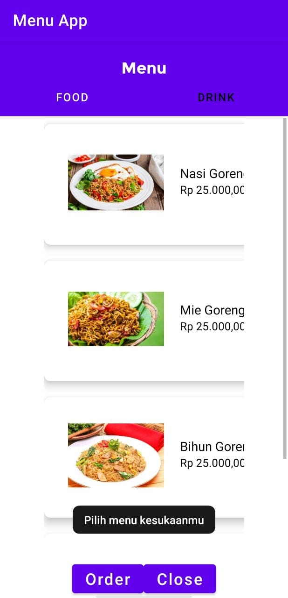

# Piranti Bergerak - Menu App

Menu App is a simple Android app that digitalize your restaurant menu and allow user to choose the menu easily. This application was built with 2 activities and 2 fragmen which connected by 2 kinds of navigation. Intent navigation is used to move between activities and View Pager is used to move between fragment. When the system in Fragment Food or Drink is paused, the application will pop a Toast "Sistem berhenti sementara". And when the system resumes, the application will pop a Tost "Pilih menu kesukaanmu". If the Menu Activity is destroyed, the application will redirect to Main Activity and the system will pop a Toast "Order diproses". 

## Overview
         
Home view, Food list view, and Drink list view of Menu App.

## Installation

Clone this repository and import into Android Studio

```bash
git clone https://github.com/varydabe/piranti-bergerak.git
```

## Usage

Build the app using Android Studio.

## Roadmap

- **(15/03/21)** Initialize menu app with 3 page and 2 navigation 
- **(22/03/21)** Change activity to fragment view and add Activity Lifecycle (OnCreate, OnPause, OnResume, and OnDestroy) 
- **(05/04/21)** Apply Model View ViewModel (MVVM) Architecture
- **Next** Consume API from third party, there's posibility to change the app theme. 

## Maintainers
This project is mantained by:
* [Dimas Shaquille Himawan](https://github.com/dshimawan)
* [Ferdinand Wijaya](https://github.com/ferdiws)
* [Varyd Abe](https://github.com/varydabe)
